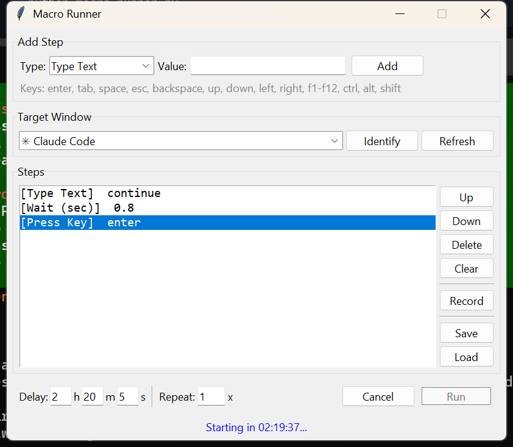

# Macro Runner

A dead-simple GUI tool that types things and presses keys for you, on a timer, in a specific window.

**Example:** Type `continue`, press Enter, in a specific terminal — 4 hours from now.




## Why

Sometimes you need to send a command to a terminal later — maybe a long build finishes overnight and you need to type `continue` and hit Enter, or you want to automate a repetitive sequence of keypresses. Most macro tools are bloated or sketchy. This one is a single Python file with a clean GUI.

## Install

```bash
pip install pyautogui pynput
```

That's it. `tkinter` comes with Python. `pygetwindow` comes with pyautogui.

## Quick Start

```bash
python macro-runner.py
```

**In 30 seconds:**

1. Pick a step type (`Type Text`, `Press Key`, or `Wait`) and a value, hit **Add**
2. Choose which window to target from the **Target Window** dropdown
3. Set your delay (hours/minutes/seconds) and hit **Run**

Done. The status bar counts down, then it focuses your target window and runs the steps.

## Features

### Step types

| Type | What it does | Example values |
|------|-------------|----------------|
| **Type Text** | Types characters one by one | `continue`, `git push`, `hello world` |
| **Press Key** | Presses a key or key combo | `enter`, `tab`, `ctrl+c`, `alt+f4` |
| **Wait (sec)** | Pauses between steps | `2`, `0.5`, `30` |

### Target a specific window

The dropdown lists every visible window. If you have two windows with the same name (e.g. two terminals), they show with position info so you can tell them apart.

- **Identify** — flashes the selected window (minimizes and restores it once) so you can see exactly which one it is
- **Refresh** — rescans if you opened or closed windows

Leave it on `(active window)` to just run against whatever's focused when the timer ends.

### Record

Hit **Record**, then type and press keys normally. Press **Esc** to stop. Your keystrokes are captured as steps — including timing gaps (pauses > 0.5s become Wait steps). Great for capturing a sequence you'd otherwise have to enter manually step by step.

### Save & Load

Save your macro as a `.json` file. Load it later. The file stores steps, delay, and loop count — everything needed to replay it exactly.

### Repeat

Set the **Repeat** count to loop the entire sequence multiple times. The target window is re-focused at the start of each loop.

### Safety

- **Cancel** button stops the macro at any point
- **Emergency stop** — move your mouse to the top-left corner of the screen (pyautogui failsafe kills execution immediately)

## Key Names

Standard key names: `enter`, `tab`, `space`, `esc`, `backspace`, `delete`, `up`, `down`, `left`, `right`, `home`, `end`, `pageup`, `pagedown`, `f1` through `f12`, `ctrl`, `alt`, `shift`, `win`

Key combos use `+`: `ctrl+a`, `ctrl+shift+s`, `alt+tab`

## Examples

**Type "yes" and press Enter in 30 minutes:**
1. Type Text → `yes`
2. Press Key → `enter`
3. Delay: 0h 30m 0s → Run

**Refresh a webpage every 10 seconds, 50 times:**
1. Press Key → `f5`
2. Wait → `10`
3. Repeat: 50 → Run

**Record a login sequence:**
1. Hit Record
2. Type your username, press Tab, type your password, press Enter
3. Press Esc to stop recording
4. Save it for later

## License

MIT
